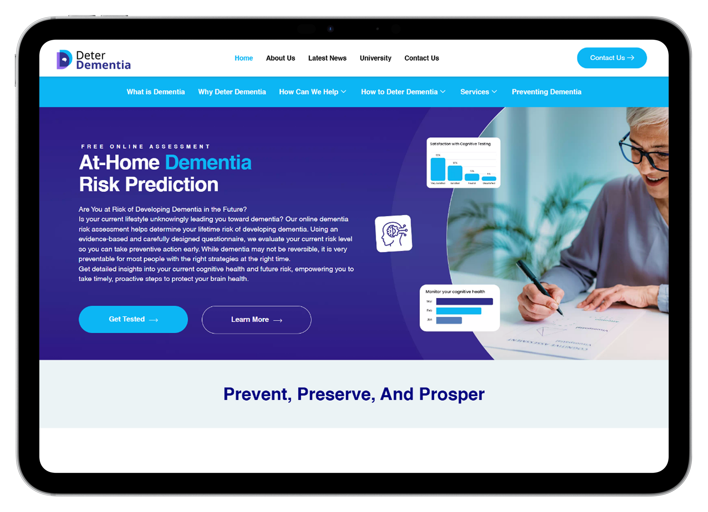
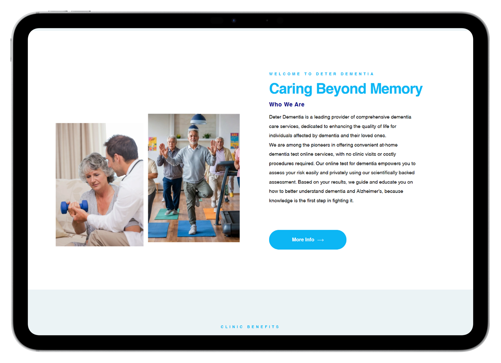
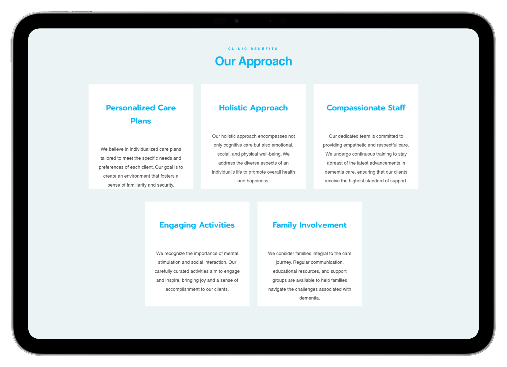
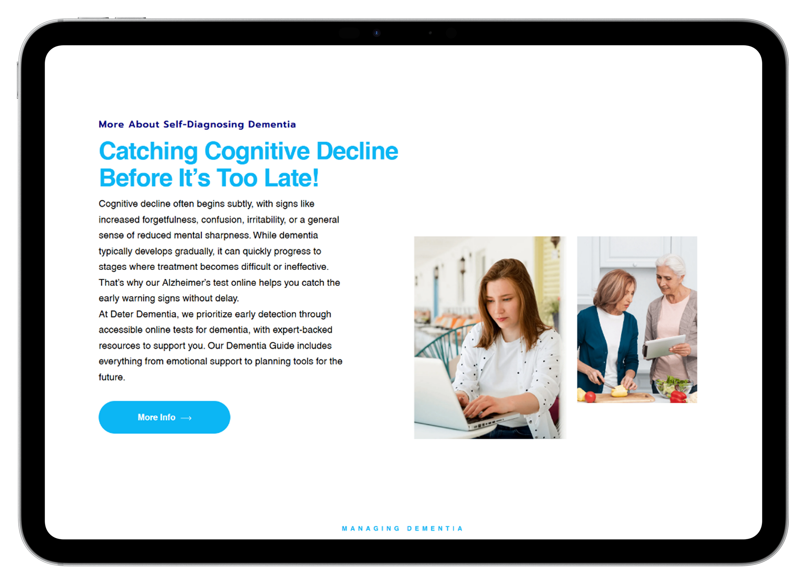
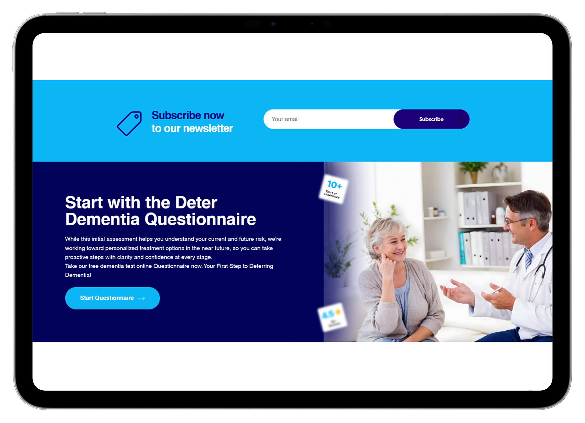

# Deter-Dementia
We transformed Deter Dementia’s online presence with a responsive website, engaging content, and targeted SEO strategies. By optimizing search rankings, leveraging social media, and implementing local SEO, we increased web traffic, strengthened brand authority, and improved lead generation. The result: higher client conversions and a stronger digital footprint in dementia care.

### Main Screenshots

## Live Site
https://deterdementia.com/
